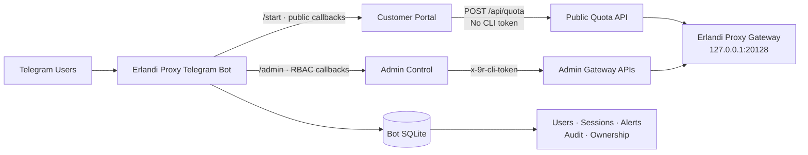

<div align="center">

# Erlandi Proxy Telegram Bot

### Customer self-service dan operations console untuk AI gateway Anda

Kelola API key, quota, model, Combo, monitoring, alert, dan pelanggan melalui Telegram—tanpa membuka dashboard di browser.

[](https://nodejs.org/)
[](https://www.typescriptlang.org/)
[](https://grammy.dev/)
[](deploy/erlandi-proxy-telegram-bot.service)
[](https://github.com/erlandi-main-api/erlandi-proxy-telegram-bot)

[Mulai Cepat](#-quick-start) · [Fitur](#-fitur) · [Arsitektur](#-arsitektur) · [Deployment](#-deployment-production) · [Keamanan](#-model-keamanan) · [Troubleshooting](#-troubleshooting)

</div>

---

## Overview

Erlandi Proxy Telegram Bot menyediakan dua pengalaman dalam satu bot:

| Customer Portal | Admin Control |
|---|---|
| Universal melalui `/start` | Terproteksi RBAC melalui `/admin` |
| Cek key tanpa registrasi Telegram | Kelola seluruh API key dan quota |
| Status, quota, persentase, expiry | Create, edit, renew, pause, delete |
| Model dan Combo yang diizinkan | Provider, Combo, usage, live monitor |
| Panduan endpoint API | User roles, alerts, audit, export CSV |
| API key tidak disimpan | Admin API memakai service token localhost |

> **Prinsip utama:** portal publik tidak pernah menerima akses admin. Request quota publik tidak mengirim `x-9r-cli-token`, sedangkan operasi admin selalu melewati RBAC dan callback bertanda tangan.

### Tampilan pelanggan

```text
Erlandi Proxy

[ Cek Kuota API Key ]
[ Panduan Penggunaan ] [ Hubungi Admin ]
```

```text
Informasi API Key

Nama: Client Premium
Status: active

Penggunaan Kuota
Kuota awal: 1.000.000 token
Terpakai: 250.000 token (25%)
Tersisa: 750.000 token (75%)
Progress: ███░░░░░░░ 25%

Masa aktif: 30 Juli 2026
Model & Combo: premium-combo, openai/gpt
```

### Tampilan admin

```text
Erlandi Proxy Control

[ API Keys ]       [ All User Quota ]
[ Monitoring ]     [ Providers & Models ]
[ Usage ]          [ Alerts ]
[ Users ]          [ Audit Log ]
[ System ]
```

## Fitur

<table>
<tr>
<td width="50%" valign="top">

### Customer self-service

- Cek API key apa pun dari inline menu
- Kuota awal, terpakai, tersisa, dan persentase
- Progress bar quota finite dan status Unlimited
- Status, masa aktif, model, dan Combo
- Panduan OpenAI-compatible endpoint
- Kontak admin dengan Telegram user ID
- Pesan key dihapus best-effort setelah verifikasi

</td>
<td width="50%" valign="top">

### API key operations

- Key otomatis atau custom
- Provider model dan Combo picker
- Search, filter, dan pagination
- Quota, expiry, allowlist, ownership
- Pause, resume, renew, edit, delete
- All User Quota dan quick renew
- CSV snapshot tanpa plaintext key

</td>
</tr>
<tr>
<td width="50%" valign="top">

### Monitoring

- Gateway health dan latency
- Active, paused, expired, exhausted
- Usage summary dan request logs
- Live request auto-refresh
- Provider/model inventory
- Low quota, expiry, gateway alerts

</td>
<td width="50%" valign="top">

### Security & governance

- Numeric Telegram ID authorization
- Owner, admin, operator, viewer
- HMAC-signed expiring callbacks
- Per-user rate limiting
- Redacted structured logging
- Audit trail administratif
- Non-root hardened systemd service

</td>
</tr>
</table>

## Arsitektur



<details>
<summary><strong>ASCII fallback</strong></summary>

```text
Telegram
   │
   └── Erlandi Proxy Telegram Bot
       ├── Public Portal ── POST /api/quota ──┐
       ├── Admin Control ─ x-9r-cli-token ────┤
       └── Bot SQLite                         │
                                             ▼
                                Erlandi Proxy Gateway
                                  127.0.0.1:20128
```

</details>

### Stack

| Layer | Teknologi |
|---|---|
| Runtime | Node.js 20+ |
| Language | TypeScript 5.9 |
| Telegram framework | grammY |
| Validation | Zod |
| Database | sql.js / SQLite file |
| Logging | pino dengan secret redaction |
| Test | Node built-in test runner |
| Process manager | systemd |

## Quick Start

> **Prasyarat:** gateway Erlandi Proxy sudah aktif pada `127.0.0.1:20128`, Node.js 20+, bot token Telegram, dan numeric owner Telegram ID.

### 1. Clone dan build

```bash
sudo git clone https://github.com/erlandi-main-api/erlandi-proxy-telegram-bot.git \
  /opt/erlandi-proxy-telegram-bot
cd /opt/erlandi-proxy-telegram-bot
sudo npm ci
sudo npm test
sudo npm prune --omit=dev
```

`npm test` sudah menjalankan build sebelum test suite.

### 2. Siapkan environment

```bash
sudo install -m 0600 /dev/null /etc/erlandi-proxy-telegram-bot.env
sudo nano /etc/erlandi-proxy-telegram-bot.env
```

Minimal configuration:

```dotenv
TELEGRAM_BOT_TOKEN="YOUR_TELEGRAM_BOT_TOKEN"
OWNER_TELEGRAM_ID="YOUR_NUMERIC_TELEGRAM_ID"
GATEWAY_URL="http://127.0.0.1:20128"
PUBLIC_API_BASE_URL="https://api.example.com/v1"
SUPPORT_CONTACT="@your_support"
GATEWAY_CLI_TOKEN="YOUR_GATEWAY_CLI_TOKEN"
CALLBACK_SECRET="YOUR_RANDOM_32_BYTE_SECRET"
DATABASE_PATH="/opt/erlandi-proxy-telegram-bot/data/bot.sqlite"
```

Lihat [cara menghasilkan CLI token](#gateway-cli-token) dan [referensi environment lengkap](#environment-reference).

### 3. Buat service user

```bash
sudo useradd --system \
  --home /opt/erlandi-proxy-telegram-bot \
  --shell /usr/sbin/nologin erlandi-bot
sudo mkdir -p /opt/erlandi-proxy-telegram-bot/data
sudo chown -R erlandi-bot:erlandi-bot /opt/erlandi-proxy-telegram-bot
sudo chmod 0700 /opt/erlandi-proxy-telegram-bot/data
```

### 4. Aktifkan systemd

```bash
sudo install -m 0644 \
  deploy/erlandi-proxy-telegram-bot.service \
  /etc/systemd/system/erlandi-proxy-telegram-bot.service
sudo systemctl daemon-reload
sudo systemctl enable --now erlandi-proxy-telegram-bot
```

### 5. Verifikasi

```bash
curl http://127.0.0.1:20128/api/health
sudo systemctl status erlandi-proxy-telegram-bot --no-pager -l
sudo journalctl -u erlandi-proxy-telegram-bot -n 50 --no-pager
```

Buka bot:

```text
/start  → Customer Portal
/admin  → Authorized Admin Control
```

## Deployment Production

<details>
<summary><strong>Persyaratan server dan gateway</strong></summary>

### Persyaratan

- Ubuntu 22.04/24.04 atau Linux dengan systemd
- Node.js 20+
- npm dan Git
- Erlandi Proxy/9router pada port `20128`
- Bot token dari BotFather
- Numeric Telegram ID owner
- Root/sudo untuk systemd

```bash
node --version
npm --version
git --version
systemctl --version
curl http://127.0.0.1:20128/api/health
```

Health response:

```json
{"ok":true}
```

Bot dan gateway idealnya berada pada VPS yang sama. Admin traffic tetap melalui localhost.

</details>

<details>
<summary><strong>Membuat bot melalui BotFather</strong></summary>

1. Buka `@BotFather`.
2. Jalankan `/newbot`.
3. Simpan bot token.
4. Dapatkan numeric owner ID melalui bot seperti `@userinfobot`.
5. Jangan menggunakan username untuk authorization.

```text
TELEGRAM_BOT_TOKEN=123456789:telegram-token
OWNER_TELEGRAM_ID=123456789
```

Jangan commit token atau memasukkannya ke shell history yang dibagikan.

</details>

<a id="gateway-cli-token"></a>
<details>
<summary><strong>Gateway CLI token</strong></summary>

Admin gateway dilindungi header:

```text
x-9r-cli-token
```

Default material files:

```text
/root/.9router/machine-id
/root/.9router/auth/cli-secret
```

Generate token:

```bash
sudo node <<'NODE'
const fs = require('node:fs');
const crypto = require('node:crypto');
const home = '/root/.9router';
const machineId = fs.readFileSync(`${home}/machine-id`, 'utf8').trim();
const secret = fs.readFileSync(`${home}/auth/cli-secret`, 'utf8').trim();
const token = crypto
  .createHash('sha256')
  .update(machineId + '9r-cli-auth' + secret)
  .digest('hex')
  .slice(0, 16);
process.stdout.write(token + '\n');
NODE
```

Sesuaikan path jika gateway memakai `HOME` atau `DATA_DIR` berbeda.

Verifikasi:

```bash
curl http://127.0.0.1:20128/api/keys \
  -H "x-9r-cli-token: GATEWAY_CLI_TOKEN"
```

Respons harus mengandung `keys`, bukan `Unauthorized`.

</details>

<a id="environment-reference"></a>
<details>
<summary><strong>Environment reference</strong></summary>

Generate callback secret:

```bash
openssl rand -hex 32
```

Production environment:

```dotenv
TELEGRAM_BOT_TOKEN="YOUR_TELEGRAM_BOT_TOKEN"
OWNER_TELEGRAM_ID="YOUR_NUMERIC_TELEGRAM_ID"

GATEWAY_URL="http://127.0.0.1:20128"
PUBLIC_API_BASE_URL="https://api.example.com/v1"
SUPPORT_CONTACT="@your_support"
GATEWAY_CLI_TOKEN="YOUR_GATEWAY_CLI_TOKEN"
CALLBACK_SECRET="YOUR_RANDOM_CALLBACK_SECRET"

DATABASE_PATH="/opt/erlandi-proxy-telegram-bot/data/bot.sqlite"
LOG_LEVEL="info"
KEY_MESSAGE_TTL_SECONDS="120"
LIVE_WATCH_SECONDS="300"
```

| Variable | Wajib | Fungsi |
|---|---:|---|
| `TELEGRAM_BOT_TOKEN` | Ya | Token BotFather |
| `OWNER_TELEGRAM_ID` | Ya | Numeric Telegram ID owner |
| `GATEWAY_URL` | Ya | Internal gateway URL |
| `PUBLIC_API_BASE_URL` | Ya | Endpoint yang diberikan ke customer |
| `SUPPORT_CONTACT` | Ya | Kontak admin/support |
| `GATEWAY_CLI_TOKEN` | Ya | Service-to-service admin token |
| `CALLBACK_SECRET` | Ya | HMAC callback secret, minimal 24 karakter |
| `DATABASE_PATH` | Ya | SQLite path yang writable |
| `LOG_LEVEL` | Tidak | `debug`, `info`, `warn`, `error` |
| `KEY_MESSAGE_TTL_SECONDS` | Tidak | TTL pesan sensitif, minimum 30 detik |
| `LIVE_WATCH_SECONDS` | Tidak | Live watch timeout, 30–1800 detik |

Quote nilai yang mengandung spasi.

```bash
sudo chown root:root /etc/erlandi-proxy-telegram-bot.env
sudo chmod 0600 /etc/erlandi-proxy-telegram-bot.env
```

</details>

<details>
<summary><strong>Non-root user dan systemd</strong></summary>

```bash
sudo useradd --system \
  --home /opt/erlandi-proxy-telegram-bot \
  --shell /usr/sbin/nologin erlandi-bot
sudo mkdir -p /opt/erlandi-proxy-telegram-bot/data
sudo chown -R erlandi-bot:erlandi-bot /opt/erlandi-proxy-telegram-bot
sudo chmod 0700 /opt/erlandi-proxy-telegram-bot/data
```

Install unit:

```bash
sudo install -m 0644 \
  deploy/erlandi-proxy-telegram-bot.service \
  /etc/systemd/system/erlandi-proxy-telegram-bot.service
sudo systemctl daemon-reload
sudo systemctl enable --now erlandi-proxy-telegram-bot
```

Database dibuat otomatis. Kunci permission sesudah startup pertama:

```bash
sudo chown erlandi-bot:erlandi-bot \
  /opt/erlandi-proxy-telegram-bot/data/bot.sqlite
sudo chmod 0600 \
  /opt/erlandi-proxy-telegram-bot/data/bot.sqlite
```

Service hardening:

- non-root user;
- `NoNewPrivileges=true`;
- `PrivateTmp=true`;
- `ProtectSystem=strict`;
- write access hanya pada direktori data.

</details>

<details>
<summary><strong>Validation checklist</strong></summary>

Gateway health:

```bash
curl http://127.0.0.1:20128/api/health
```

Telegram identity:

```bash
set -a
source /etc/erlandi-proxy-telegram-bot.env
set +a
curl "https://api.telegram.org/bot${TELEGRAM_BOT_TOKEN}/getMe"
```

Public quota endpoint:

```bash
curl -X POST http://127.0.0.1:20128/api/quota \
  -H 'Content-Type: application/json' \
  -d '{"key":"INVALID_TEST_KEY"}'
```

Expected invalid response:

```json
{"error":"API key not found"}
```

Admin API:

```bash
curl http://127.0.0.1:20128/api/keys \
  -H "x-9r-cli-token: ${GATEWAY_CLI_TOKEN}"
```

Filesystem permissions:

```bash
stat -c '%a %U:%G %n' \
  /etc/erlandi-proxy-telegram-bot.env \
  /opt/erlandi-proxy-telegram-bot/data/bot.sqlite
```

Keduanya seharusnya mode `600`.

Telegram UX:

- user biasa dapat memakai `/start`;
- user biasa dapat cek API key;
- user biasa tidak dapat membuka `/admin`;
- owner dapat membuka `/admin`.

</details>

## Model Keamanan

| Boundary | Proteksi |
|---|---|
| Public quota | Tidak mengirim admin CLI token |
| Raw customer key | Tidak disimpan DB/audit/callback/output |
| Admin authorization | Numeric Telegram ID + RBAC |
| Callback actions | HMAC signature + expiry + vault payload |
| Abuse prevention | Per-user rate limit |
| Logs | Structured dan secret-redacted |
| Environment | Root-owned mode `0600` |
| Database | Service-owned mode `0600` |
| Runtime | Non-root hardened systemd |

<details>
<summary><strong>Security checklist</strong></summary>

- [ ] Repository tidak mengandung `.env` atau token
- [ ] Environment file mode `0600`
- [ ] Database mode `0600`
- [ ] Bot berjalan sebagai non-root
- [ ] Gateway admin hanya melalui localhost/service token
- [ ] Public handler tidak mengirim `x-9r-cli-token`
- [ ] Numeric Telegram ID digunakan untuk RBAC
- [ ] `CALLBACK_SECRET` random dan unik
- [ ] Gateway tidak diekspos tanpa firewall/reverse proxy
- [ ] Backup database dan environment disimpan aman
- [ ] Log diperiksa setiap selesai update

</details>

## Commands

| Command | Audience | Fungsi |
|---|---|---|
| `/start` | Publik | Customer self-service portal |
| `/admin` | Authorized users | Operations control panel |
| `/cancel` | Semua user | Membatalkan flow aktif |

Commands, short description, dan full description diatur otomatis saat startup.

## Data & Operations

<details>
<summary><strong>Database schema dan backup/restore</strong></summary>

Default database:

```text
/opt/erlandi-proxy-telegram-bot/data/bot.sqlite
```

Tabel utama:

- `users` — Telegram ID, role, status;
- `audit` — aktivitas admin;
- `sessions` — wizard state admin;
- `alerts` — operational alerts;
- `key_owners` — key ID dan Telegram owner;
- `renewal_requests` — metadata renewal tanpa raw key.

Owner dibuat otomatis dari `OWNER_TELEGRAM_ID`.

Backup:

```bash
sudo systemctl stop erlandi-proxy-telegram-bot
sudo install -m 0600 \
  /opt/erlandi-proxy-telegram-bot/data/bot.sqlite \
  "/root/erlandi-bot-$(date +%Y%m%d-%H%M%S).sqlite"
sudo systemctl start erlandi-proxy-telegram-bot
```

Restore:

```bash
sudo systemctl stop erlandi-proxy-telegram-bot
sudo cp /root/BACKUP.sqlite \
  /opt/erlandi-proxy-telegram-bot/data/bot.sqlite
sudo chown erlandi-bot:erlandi-bot \
  /opt/erlandi-proxy-telegram-bot/data/bot.sqlite
sudo chmod 0600 \
  /opt/erlandi-proxy-telegram-bot/data/bot.sqlite
sudo systemctl start erlandi-proxy-telegram-bot
```

Backup environment secara terpisah ke secret storage. Jangan masukkan ke Git.

</details>

<details>
<summary><strong>Update dan rollback</strong></summary>

Update:

```bash
cd /opt/erlandi-proxy-telegram-bot
sudo -u erlandi-bot git pull --ff-only origin main
sudo npm ci
sudo npm test
sudo npm prune --omit=dev
sudo chown -R erlandi-bot:erlandi-bot \
  /opt/erlandi-proxy-telegram-bot
sudo systemctl restart erlandi-proxy-telegram-bot
sudo systemctl status erlandi-proxy-telegram-bot --no-pager
```

Catat commit dan backup build sebelum update:

```bash
git rev-parse HEAD
sudo cp -a dist "/root/erlandi-bot-dist-$(date +%Y%m%d-%H%M%S)"
```

Rollback:

```bash
cd /opt/erlandi-proxy-telegram-bot
sudo -u erlandi-bot git checkout COMMIT_YANG_STABIL
sudo npm ci
sudo npm test
sudo npm prune --omit=dev
sudo systemctl restart erlandi-proxy-telegram-bot
```

Jangan gunakan `git reset --hard` bila ada perubahan lokal yang belum diamankan.

</details>

## Troubleshooting

<details open>
<summary><strong>Diagnosis cepat</strong></summary>

```bash
sudo systemctl is-active erlandi-proxy-telegram-bot
sudo journalctl -u erlandi-proxy-telegram-bot -n 200 --no-pager
curl http://127.0.0.1:20128/api/health
```

| Gejala | Periksa |
|---|---|
| Restart loop | Env wajib, `dist`, node_modules, writable DB |
| Bot diam | Bot token, duplicate polling instance, journal |
| `/admin` ditolak | Numeric owner ID dan database path |
| Public quota gagal | Endpoint `/api/quota` dan SaaS key store |
| Admin Unauthorized | Regenerate `GATEWAY_CLI_TOKEN` |
| Build OOM | Build di mesin lain atau tambah swap |

</details>

<details>
<summary><strong>Perintah diagnosis detail</strong></summary>

Bot identity:

```bash
curl "https://api.telegram.org/bot${TELEGRAM_BOT_TOKEN}/getMe"
```

Public quota:

```bash
curl -X POST "${GATEWAY_URL}/api/quota" \
  -H 'Content-Type: application/json' \
  -d '{"key":"VALID_API_KEY"}'
```

Logs realtime:

```bash
sudo journalctl -u erlandi-proxy-telegram-bot -f
```

Pastikan tidak ada instance lain yang memakai token Telegram sama dengan long polling.

Jika build kehabisan memori, transfer hasil `dist/` dari mesin build dan jalankan `npm ci --omit=dev` pada VPS.

</details>

## Development

<details>
<summary><strong>Local development dan testing</strong></summary>

```bash
npm ci
npm run check
npm test
npm run dev
```

Test suite mencakup:

- RBAC;
- signed callbacks dan long payload vault;
- rate limiting;
- admin gateway header;
- public quota/health tanpa CLI token;
- provider/model dan Combo mapping;
- SQLite persistence;
- renewal metadata tanpa raw key;
- quota summary/filter/sort/CSV;
- quota percentage dan progress bar.

Untuk VPS kecil, lakukan build/test pada CI atau workstation lalu deploy `dist/` dan production dependencies.

</details>

---

<div align="center">

**[Erlandi Proxy Telegram Bot](https://github.com/erlandi-main-api/erlandi-proxy-telegram-bot)**

Built for secure, practical AI gateway operations.

<sub>Jangan pernah commit token Telegram, gateway token, callback secret, atau customer API key.</sub>

</div>
